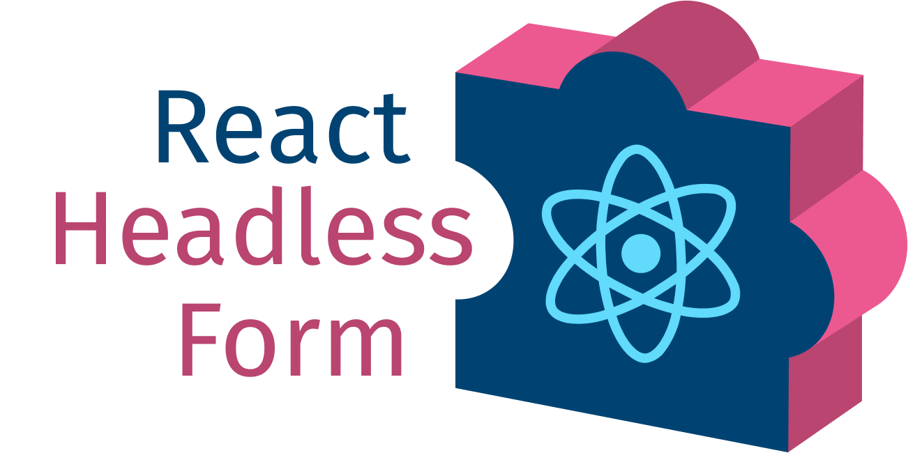

<div align="center">
    <a href="https://react-hook-form.com" title="React Hook Form - Simple React forms validation">
        
    </a>
</div>

<p align="center">
    <b>
        Form as configuration. Bring your own UI, entirely. Great DX. Built on React Hook Form.
    </b>
</p>


> [!WARNING]
> This project is still under active development. Expect breaking changes until `v1.0.0` is reached.

## Installation

```sh
npm install react-headless-form
# or
pnpm add react-headless-form
# or
yarn add react-headless-form
```

## What is it?

A config-driven, headless form engine built on top of [React Hook Form](https://react-hook-form.com/).

Instead of wiring `useController` and `<Controller />` by hand on every form, you define a field mapping once, then describe your forms as plain configuration. This package handles all RHF wiring under the hood — validation, nested models, conditional visibility, arrays, and i18n — while your field components stay completely decoupled from form logic.


## ✨ Features

- 🧩 **Bring your own UI** — `value`, `onChange`, `label`, and form field essentials at your fingertips, without fighting RHF or TypeScript. You define your own field types: `text`, `select`, or even a `superman` field.
- ⚡ **Great DX** — set up the form once, get full type and prop hints from your TypeScript model, plus extra UI-only fields with zero TypeScript complaints.
- 🧠 **Powerful Composition Model** — build forms from reusable schema blocks and assemble them like Lego into workflows of any complexity.
- 🌍 **i18n-ready** — plug in any i18n solution (`i18next`, `react-intl` or your own), configure once, and labels, descriptions, and validation messages ready to fields without caring about the app language.
- 🛠️ **Extensible Form Root** — Empower your form shell by easily injecting DevTools, status bars, error summaries, or any custom logic via `renderRoot`.
- 🧱 **Still just [React Hook Form](https://react-hook-form.com/)** — pass `useForm` options, access RHF hooks, and keep full control since fields live inside the form context.
- 📱 **Platform-agnostic** — no web-specific assumptions. While not tested with React Native yet, compatibility should follow React Hook Form.

## Quick example

```tsx
import { setupForm } from "react-headless-form";

const [Form] = setupForm();

export default function App() {
  return (
    <Form
      renderRoot={({ children, onSubmit }) => (
        <form onSubmit={onSubmit}>{children}</form>
      )}
      config={{
        name: {
          type: "inline",
          render: ({ fieldProps: { value = "", onChange } }) => (
            <input
              placeholder="Your name"
              value={value}
              onChange={onChange}
            />
          ),
        },
      }}
      onSubmit={(data) => alert(JSON.stringify(data, null, 2))}
    >
      <button type="submit">Submit</button>
    </Form>
  );
}
```

## Documentation

Full documentation, API reference, and examples are available at **[bonniss.github.io/react-headless-form](https://bonniss.github.io/react-headless-form/)**.

## License

[MIT](LICENSE)
