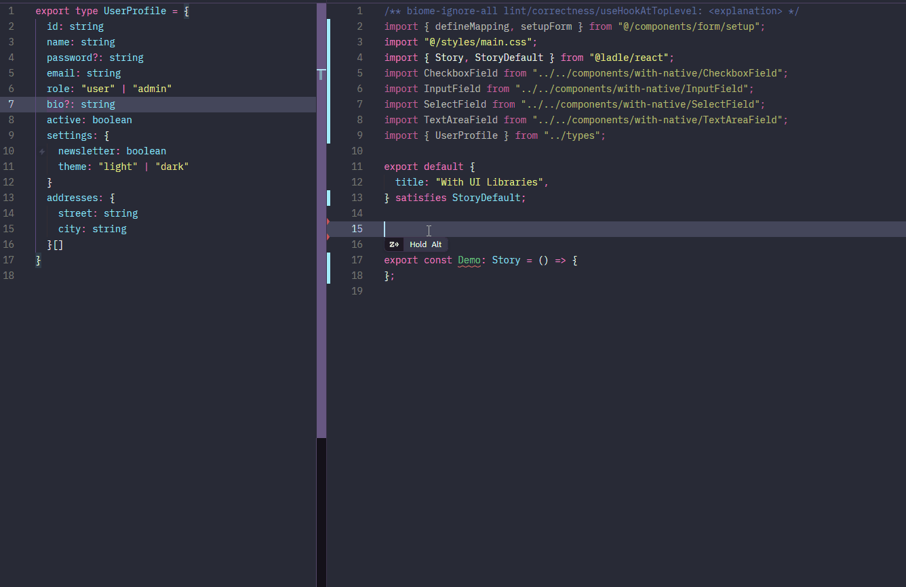

# React headless form

> Form as configuration. Bring your own UI, entirely. Great DX. Built on React Hook Form.



> [!WARNING]
> This project is still under active development. Expect breaking changes until `v1.0.0` is reached.

## ✨ Features

- 🧩 **Bring your own UI** — `value`, `onChange`, `label`, and form field essentials at your fingertips, without fighting RHF or TypeScript. You define your own field types: `text`, `select`, or even a `superman` field.
- ⚡ **Great DX** — set up the form once, get full type and prop hints from your TypeScript model, plus extra UI-only fields with zero TypeScript complaints.
- 🧠 **Powerful Composition Model** — build forms from reusable schema blocks and assemble them like Lego into workflows of any complexity.
- 🌍 **i18n-ready** — plug in any i18n solution (`i18next`, `react-intl` or your own), configure once, and labels, descriptions, and validation messages ready to fields without caring about the app language.
- 🛠️ **Extensible Form Root** — Empower your form shell by easily injecting DevTools, status bars, error summaries, or any custom logic via `renderRoot`.
- 🧱 **Still just [React Hook Form](https://react-hook-form.com/)** — pass `useForm` options, access RHF hooks, and keep full control since fields live inside the form context.
- 📱 **Platform-agnostic** — no web-specific assumptions. While not tested with React Native yet, compatibility should follow React Hook Form.

## Introduction

> [!NOTE]
>
> The package was originally named `blueform`, but npm rejected the publication because the name was deemed too similar to an existing package. We then switched to **react-headless-form** — a clear and descriptive name, though somewhat verbose. Unfortunately, abbreviating it as “RHF” isn’t practical, as that acronym is almost universally associated with **React Hook Form** (for the skeptics — just try googling “RHF”).
>
> For this reason, throughout the documentation we refer to the library simply as **BlueForm**. This is a short, memorable codename carried over from the original `blueform` name, and it’s the term we’ve consistently used during development and design discussions.

React Hook Form (RHF) is brilliant. It removes a large amount of boilerplate and makes building forms faster and easier. But as applications grow, the patterns used to wire RHF itself often become the next layer of boilerplate.

You copy setup patterns from previous projects, yet still hesitate over: should this field of the new UI library use `register`, `useController`, or `<Controller />`? Do we introduce helpers to separate logic from layout? Do we wrap everything in context-aware components? Each project tweaks the pattern slightly, and those tweaks accumulate.

Individually, these decisions are trivial. Collectively, they create architectural noise.

Input wiring should not be the dominant concern in a form system. It should fade into the background, so teams can focus on structure, composition, and behavior — the parts that actually define how a form works as a whole.

With **BlueForm**, building a form becomes a clear process:

**0. Define your fields (optional, incremental)**
Register reusable building blocks through `fieldMapping`, which maps a type name to a React component. The mapping is entirely yours. This step is optional, as BlueForm includes built-in primitives that are sufficient for many use cases, allowing you to start immediately and extend incrementally as your design system grows.

**1. Define how your root form element is rendered**
Decide how the form itself is structured: form, grid layout, wizard container, or anything else.

**2. Describe your form as configuration**
Compose your form using your own fields, validation rules, layout-related properties, and built-in structural types.

**3. Define form behavior**
Handle submission, side effects, conditional visibility, and integrations—without coupling them to layout.

And that's it - you now have a working form. The reason step **0** comes first is intentional. In most applications, fields are defined far less frequently than forms themselves. You typically know the input shapes your domain requires, and once those field types are established, they are reused across many forms. Similarly, step **1** is often optional. Many applications share the same root form structure, meaning you define it once and rarely touch it again.

With BlueForm, you focus on form structure — how fields are organized, how they relate to each other, and how the form behaves as a whole. UI becomes an implementation detail, not the driving concern.

## Getting started

### Installation

```sh
npm install react-headless-form
# or
pnpm add react-headless-form
# or
yarn add react-headless-form
```

### Your first form - A login form

#### 0. Define the data model

You want to collect an username and password from user.

```tsx
type LoginData = {
  username: string;
  password: string;
}
```

A native HTML `<input />` is enough to describe both fields — one with type `text`, the other with type `password`. Once you’re familiar with the flow, the same approach works with any UI library. Let's define a reusable `InputField`.

#### 1. Describe the field

```tsx
import { useField } from "react-headless-form"

type InputFieldProps = React.InputHTMLAttributes<HTMLInputElement>

export default function InputField(props: InputFieldProps) {
  const {
    fieldProps: { value, onChange, label, errorMessage, required, disabled },
  } = useField()

  return (
    <div>
      {label && (
        <label>
          {label} {required && "*"}
        </label>
      )}

      <input
        {...props}
        value={value}
        onChange={(e) => onChange?.(e.target.value)}
        disabled={disabled}
      />

      {errorMessage && (
        <div className="text-red-600 mt-2">{errorMessage}</div>
      )}
    </div>
  )
}
```

Notice that the field receives everything it needs to be functional without needing to know where those values come from. It only cares about how and where things are rendered, while all logic is handled by the form engine.
This makes field components reusable. See [Field authoring](#field-authoring) for more details.

#### 2. Describe the form

```tsx
import { setupForm, defineMapping } from "react-headless-form"
import InputField from "./InputField"

// Set up Form component
const [Form] = setupForm({
  // Define the field mapping
  fieldMapping: defineMapping({
    text: InputField,
  }),
  // Define how the root form is rendered
  renderRoot: ({ children, onSubmit }) => (
    <form onSubmit={onSubmit}>{children}</form>
  ),
})

export function LoginForm() {
  return (
    <Form<LoginData>
      // Describe the form as configuration
      config={{
        username: {
          type: "text",
          label: "Username",
          rules: {
            required: "Username is required",
          },
        },
        password: {
          type: "text",
          label: "Password",
          props: {
            type: "password",
          },
          rules: {
            required: "Password is required",
            minLength: {
              value: 6,
              message: "Password too short",
            },
          },
        },
      }}
      // Define form behavior, data is recognized as LoginData
      onSubmit={(data) => {
        console.log("Login data:", data)
      }}
    >
      <button type="submit">Login</button>
    </Form>
  )
}
```

The form is described entirely as configuration. Field types are mapped to components, validation rules are declared alongside each field, and `onSubmit` receives fully typed form data.

### The mighty `Form`

This package does not expose a single global `<Form />` component. Instead, each `Form` is created through a setup step, where a **base configuration** is defined and bound to the form instance.

This setup determines how the form behaves by default: which field types are available, how the root form is rendered, and how validation or i18n is handled. Once created, the resulting `Form` component comes with several key advantages:

- it is bound to a specific **field mapping**, restricting valid field types at compile time
- it is bound to a **form data model**, ensuring strong typing for configuration and submission

#### Bound to a field mapping

When a `Form` is created, it is bound to a specific field mapping.
This mapping defines which field types are available and how they are rendered.

By default, BlueForm provides a set of built-in field types
(`inline`, `section`, `array`, `hidden`).
Calling `setupForm()` with no arguments uses only these built-in types.

```ts
const [Form] = setupForm()
```

To extend the form with custom fields while keeping all built-in ones available, use `defineMapping`:

```ts
const [Form] = setupForm({
  fieldMapping: defineMapping({
    text: InputField,
    select: SelectField,
  }),
})
```

With this setup, valid field types include:

- all built-in field types
- `"text"` and `"select"` defined above

Any unknown field type will be caught at compile time.

```ts
config={{
  username: {
    type: "text", // ✅ custom
  },
  profile: {
    type: "section", // ✅ built-in
  },
  age: {
    type: "number", // ❌ compile-time error
  },
}}
```

#### Bound to a data model

`Form` is generic. Field keys must match the data model, and `onSubmit` always receives fully typed data.

```ts
<Form<LoginData>
  config={{
    username: {
      type: "text",
    },
    password: {
      type: "text",
    },
  }}
  onSubmit={(data) => {
    // data is inferred as LoginData
    data.username
    data.password
  }}
/>
```

#### Overriding base configuration

Base configuration defined in `setupForm` applies to all forms created from it.
In some cases, you may want to override this behavior for a specific form instance.

Most base options can be overridden via `<Form />` props at usage time. For example, `renderRoot` can be customized per form. Note that `renderRoot` must be provided either during setup or overridden at usage time, otherwise the form will throw an error.

```ts
const [Form] = setupForm({
  renderRoot: ({ children, onSubmit }) => (
    <form className="default-form" onSubmit={onSubmit}>{children}</form>
  ),
})
```

```tsx
<Form
  renderRoot={({ children, onSubmit }) => (
    <form className="product-form" onSubmit={onSubmit}>{children}</form>
  )}
/>
```

Internationalization behavior can also be overridden when needed:

```ts
const [Form] = setupForm({
  i18nConfig: {
    t: defaultTranslate,
  },
})
```

```tsx
<Form
  i18nConfig={{
    t: adminTranslate,
  }}
/>
```

The only option that **cannot** be overridden is `fieldMapping`, even at runtime. It is fixed at setup time to preserve compile-time [type safety](#type-safety).

### `defineConfig` when needed

For flat form structures, `<Form<TModel>>` is enough as types flow naturally from `Form<TModel>` into the configuration. However, with nested structures, TypeScript can no longer infer the model shape automatically. In these cases, `defineConfig` - the second value returned from `setupForm` - is used to explicitly mark that typing boundary.

```tsx
type LoginData = {
  account: {
    username: string
    password: string
  }
}

const [Form, defineConfig] = setupForm({
  fieldMapping: defineMapping({
    text: InputField,
  }),
})

<Form<LoginData>
  config={{
    account: {
      type: "section",
      config: defineConfig<LoginData["account"]>({
        username: {
          type: "text",
        },
        password: {
          type: "text",
        },
      }),
    },
  }}
/>
```

Another common use case for `defineConfig` is to define configurations once and import them wherever needed, while still preserving the same field mapping and typing rules.

```ts
// form.setup.ts
import { setupForm, defineMapping } from "react-headless-form"
import InputField from "./InputField"

export const [Form, defineConfig] = setupForm({
  fieldMapping: defineMapping({
    text: InputField,
  }),
})
```

```ts
// login.form.ts
import type { LoginData } from "./types"
import { defineConfig } from "./form.setup"

export const loginFormConfig = defineConfig<LoginData>({
  username: {
    type: "text",
    label: "Username",
  },
  password: {
    type: "text",
    props: {
      type: "password",
    },
  },
})
```

```tsx
// LoginPage.tsx
import { Form } from "./form.setup"
import { loginFormConfig } from "./login.form"

<Form<LoginData>
  config={loginFormConfig}
  onSubmit={(data) => {
    console.log(data)
  }}
>
  <button type="submit">Login</button>
</Form>
```

### `Section` for reusable composition

`setupForm()` returns a tuple: `[Form, defineConfig, Section]`.

The third item, `Section`, is a helper component for authoring a **typed config fragment** from inside another component.

```tsx
const [Form, defineConfig, Section] = setupForm({
  fieldMapping: defineMapping({
    text: InputField,
  }),
})
```

This is designed to be used together with `type: "section"` in your schema, where the section “owns” its UI via `section.props.component`, and the component “owns” the fields it contains via `<Section />`.

In the wizard example below, each step is a `section`:

- the **wizard UI state** (`step`) lives outside the form engine
- each step’s `section.visible()` decides whether that step is currently shown
- all steps still share **one RHF form state** (the form engine doesn’t know anything about “steps”)

```tsx
const [Form, defineConfig, Section] = setupForm({ ... })

<Form<WizardForm>
  config={{
    account: {
      type: "section",
      visible: () => step === 0,
      props: { nested: true, component: AccountStep },
    },
    profile: {
      type: "section",
      visible: () => step === 1,
      props: { nested: true, component: ProfileStep },
    },
    preferences: {
      type: "section",
      visible: () => step === 2,
      props: { nested: true, component: PreferencesStep },
    },
  }}
/>
```

Inside each step component (e.g. `AccountStep`), the component is rendered *as the section*, so it can read section-level props like `label` and `visible` via `useField()`:

```tsx
function AccountStep() {
  const { fieldProps } = useField()
  if (!fieldProps.visible) return null

  return (
    <fieldset>
      <legend>{fieldProps.label}</legend>

      <Section<WizardForm["account"]>
        config={{
          email: { type: "text", label: "Email" },
          password: { type: "text", label: "Password", props: { type: "password" } },
        }}
      />
    </fieldset>
  )
}
```

Key idea: **the parent schema declares the section boundary**, and the step component fills that boundary with a **typesafe config fragment**. This makes it easy to:

* split a complex form into small, focused section components
* reuse those section components across pages/forms
* build “any complexity” flows (wizard, tabs, conditional layouts) without introducing special form concepts — it’s still just `section` + composition

### More examples

Visit [our ladle](https://bonniss.github.io/react-headless-form/) for more examples.

## Type safety

### Configuration keys

Form configuration keys are type-checked against your form model.

```ts
type User = {
  name: string
  profile: {
    email: string
  }
  addresses: {
    city: string
  }[]
}
```

For simple, non-nested fields like `name`, keys map directly to model properties:

```ts
{
  name: {
    type: "text",
  },
}
```

For nested fields, there are two supported approaches.

### Option A: Using structural primitives

Use `section` (with `nested: true`) for nested objects:

```ts
{
  profile: {
    type: "section",
    props: {
      nested: true,
      config: defineConfig<User["profile"]>({
        email: { type: "text" },
      }),
    },
  },
}
```

Use `array` for arrays of objects:

```ts
{
  addresses: {
    type: "array",
    props: {
      config: defineConfig<User["addresses"][number]>({
        city: { type: "text" },
      }),
    },
  },
}
```

When using `section` (nested) or `array`, you must call `defineConfig` for the nested model (`User["profile"]`, `User["addresses"][number]`), because TypeScript cannot automatically infer nested object shapes across abstraction boundaries.

### Option B: Using flat nested keys

You can also reference nested object paths using dot notation:

```ts
{
  "profile.email": {
    type: "text",
  },
}
```

Invalid paths are caught at compile time:

```ts
"profile.age" // ❌ Type error – not part of User
```

Flat keys apply to **object paths only**; array paths are intentionally excluded, as their indices are resolved dynamically at runtime.

### Field props

Each field’s `type` maps directly to a component registered in `fieldMapping`.

```ts
const fieldMapping = defineMapping({
  text: InputField,
  select: SelectField,
})
```

BlueForm ensures that:

- `type` must exist in `fieldMapping`
- `props` must match the mapped component’s props

```ts
defineConfig<User>({
  name: {
    type: "text",
    props: {
      placeholder: "Your name", // ✅ valid
      options: [], // ❌ invalid for text field
    },
  },
})
```

### Virtual configuration keys

In many forms, some nodes exist purely for layout or presentation — such as previews, separators, banners, or structural containers.

You should not have to modify your form model just to accommodate UI concerns.
These nodes simply **should not be validated against the form model keys**.

BlueForm uses a simple convention:

> Any configuration key starting with `__` is treated as a **virtual key**.

Virtual keys are excluded from model key checking, so TypeScript will not raise errors for them.

```tsx
<Form<UserForm>
  config={{
    firstName: { type: "text" },
    lastName: { type: "text" },

    // Virtual key (not checked against UserForm)
    __fullNamePreview: {
      type: "section",
      render: () => <FullNamePreview />,
    },
  }}
/>
```

Virtual keys are ideal for:

* layout containers
* computed previews
* dividers or separators
* informational blocks
* any composition node that should not exist in the data model

#### Caveats

* If your actual form model contains fields starting with `__`, they will not receive key suggestions in the configuration, since the prefix is reserved for virtual nodes.
* If a field should be type-safe and checked against the model, it must **not** use the `__` prefix — even if it renders only UI.

#### Type guidance, not runtime enforcement

> [!IMPORTANT]
>
> Virtual keys are a **type-level convention** designed to improve authoring experience and maintain separation between data and UI.
>
> They do not enforce runtime isolation.
> All fields still have access to React Hook Form’s `useFormContext`, meaning runtime reads or mutations of form state remain possible.
>
> It is the developer’s responsibility to follow the convention intentionally and ensure that virtual nodes do not introduce unintended side effects.

## Built-in types

BlueForm ships with a minimal set of composable primitives.

| Type      | Purpose     | In form state | Submitted |
|-----------|------------|---------------|-----------|
| `inline`  | Field      | ✓             | ✓         |
| `section` | Container  | Optional¹     | Optional¹ |
| `array`   | Field list | ✓             | ✓         |
| `hidden`  | Hidden     | ✓             | ✓         |

¹ `section` participates in form state only when `nested: true` and a `config` is provided.
Otherwise, it acts as a structural container.

### `inline`

Inline fields are **one-off custom fields** defined directly in the form configuration.

```tsx
{
  nickname: {
    type: "inline",
    label: "Nickname",
    render: ({ fieldProps }) => (
      <input
        value={fieldProps.value ?? ""}
        onChange={(e) =>
          fieldProps.onChange?.(e.target.value)
        }
      />
    ),
  }
}
```

Use `inline` when:

- the field is highly specific or not reused elsewhere
- defining a reusable field component is unnecessary

### `section`

`section` is the core container primitive of BlueForm that can:

* wrap other fields for layout
* introduce a namespace boundary
* render custom UI
* encapsulate reusable form modules
* contain other sections recursively

#### Container (no namespace)

When `nested` is omitted or `false`, `section` acts as a structural container.
Fields remain at the current level in the form state.

```tsx
layout: {
  type: "section",
  render: ({ children }) => <Card>{children}</Card>,
  props: {
    config: defineConfig({
      firstName: { type: "inline" },
      lastName: { type: "inline" },
    }),
  },
}
```

Submission shape:

```ts
{
  firstName: string
  lastName: string
}
```

Use case:

* layout grouping
* visual structure
* card / tab / panel wrappers

#### Namespace Boundary (`nested: true`)

When `nested: true` is provided, the section key becomes a namespace in the form state and submission payload.

```tsx
profile: {
  type: "section",
  props: {
    nested: true,
    config: defineConfig({
      firstName: { type: "inline" },
      lastName: { type: "inline" },
    }),
  },
}
```

Submission shape:

```ts
{
  profile: {
    firstName: string
    lastName: string
  }
}
```

Use case:

* mirroring domain models
* grouping related data
* building structured payloads

#### Component Mode

Instead of inline `config`, a `section` can delegate rendering to a reusable component.

```tsx
address: {
  type: "section",
  props: {
    nested: true,
    component: AddressSection,
  },
}
```

This enables:

* splitting large forms into smaller modules
* reusing form blocks across pages
* encapsulating complex form logic
* composing forms like Lego pieces

Because `section` is recursive, complex forms are built by composing smaller sections — allowing you to scale from simple inputs to arbitrarily complex form systems without introducing new schema concepts.

### `array`

Arrays represent **repeatable groups of fields**.

```tsx
addresses: {
  type: "array",
  label: "Addresses",
  props: {
    config: defineConfig({
      street: { type: "inline" },
      city: { type: "inline" },
    }),
  },
}
```

Array fields are backed by RHF’s `useFieldArray` under the hood.

### `hidden`

Hidden fields participate in form state but render no visible UI.

```tsx
token: {
  type: "hidden",
  defaultValue: "abc123",
}
```

With just these built-in field types, you can cover quite of use cases. For example, the login form shown earlier can be implemented entirely using `inline` fields.

```tsx
<Form<LoginData>
  config={{
    username: {
      type: "inline",
      label: "Username",
      rules: {
        required: "Username is required",
      },
      render: ({ fieldProps: { value, onChange, label, errorMessage } }) => (
        <div className="form-item">
          <label>{label}</label>
          <input
            value={value ?? ""}
            onChange={(e) => onChange?.(e.target.value)}
          />
          {errorMessage && <div style={{ color: "red" }}>{errorMessage}</div>}
        </div>
      ),
    },

    password: {
      type: "inline",
      label: "Password",
      rules: {
        required: "Password is required",
      },
      render: ({ fieldProps: { value, onChange, label, errorMessage } }) => (
        <div className="form-item">
          <label>{label}</label>
          <input
            type="password"
            value={value ?? ""}
            onChange={(e) => onChange?.(e.target.value)}
          />
          {errorMessage && <div style={{ color: "red" }}>{errorMessage}</div>}
        </div>
      ),
    },
  }}
/>
```

## Field authoring

### `useField`

Every field component interacts with the form through a shared contract, exposed via `useField`. It exposes a **stable, normalized interface** on top of RHF’s `useController`, so field authors do not need to interact with RHF directly.

```ts
const { fieldProps, controller, config } = useField()
```

In most cases, **you only need `fieldProps`**. It contains **everything a field needs to render itself correctly**, without knowing anything about the rest of the form.

#### `fieldProps`

`fieldProps` is the primary object used to build field UI.
It contains **everything a field needs to render itself correctly**, without knowing anything about the rest of the form.

##### Value and interaction

```ts
fieldProps.value
fieldProps.onChange
```

- `value`
  The current field value, sourced from RHF via `useController`.

- `onChange`
  A change handler that **expects the final value**, not a DOM event.

```tsx
onChange?.(e.target.value) // ✅ correct
onChange?.(e) // ❌ incorrect
```

##### Error handling

```ts
fieldProps.errorMessage
```

- A translated error message derived from RHF’s validation state
- Ready to be rendered directly

```tsx
{
  errorMessage && <div>{errorMessage}</div>
}
```

Field components **should not inspect validation rules or error objects** — only display this message.

##### Identity and structure

```ts
fieldProps.id
fieldProps.name
fieldProps.path
fieldProps.namespace
```

- `name`
  The field key within its immediate object (e.g. `"email"`)

- `path`
  The full path used by RHF (e.g. `"profile.email"`)

- `namespace`
  The parent scope, when the field is nested

These values are useful for:

- accessibility (`id`, `htmlFor`)
- debugging
- advanced integrations

##### Labeling and metadata

```ts
fieldProps.label
fieldProps.description
fieldProps.required
```

- `label`
  A translated label, already resolved by BlueForm

- `description`
  Optional helper text, also translated

- `required`
  A boolean derived from validation rules

Field components should **not infer `required` from rules themselves**.

##### Read-only and disabled state

```ts
fieldProps.disabled
fieldProps.readOnly
```

- `disabled`
  Indicates the field should not accept interaction

- `readOnly`
  Indicates the field should display its value without allowing edits

##### Visibility

```ts
fieldProps.visible
```

- Indicates whether the field should be rendered
- Visibility is **resolved at the orchestration level**
- Field components should simply respect it

```tsx
if (!visible) return null
```

#### `controller`

```ts
const { controller } = useField()
```

This is the raw result of RHF’s `useController`.

Most fields **should not need this**.

Use `controller` only when:

- integrating deeply with third-party components
- needing access to `fieldState` or `formState`
- handling non-standard input behavior

#### `config`

```ts
const { config } = useField()
```

- The original field configuration object
- Useful for highly dynamic or meta-driven fields
- Not required for standard field rendering

### `useArrayField`

`useArrayField` is the field-level API for working with **array fields**. It provides a thin, predictable abstraction on top of React Hook Form’s [`useFieldArray`](https://react-hook-form.com/docs/usefieldarray).

```ts
const {
  fieldProps,
  items,
  renderItem,
  renderItems,

  // RHF field-array operations
  append,
  prepend,
  insert,
  remove,
  move,
  swap,
  update,
  replace,

  // convenience helpers
  push,
  pop,
  clear,
  duplicate,
  idAt,
  errorAt,
} = useArrayField()
```

You typically use `useArrayField` in a dedicated component (recommended), or directly inside the `render` of the built-in `array` type.

#### `fieldProps`

```ts
fieldProps.errorMessage
fieldProps.label
fieldProps.required
fieldProps.disabled
```

`fieldProps` behaves the same way as in `useField`, but at the **array level**.

* `errorMessage`
  Represents array-level validation errors (e.g. `minLength`, `required`).
  These errors are associated with the array itself, not individual items.

```tsx
{fieldProps.errorMessage && <div>{fieldProps.errorMessage}</div>}
```

#### Array methods

RHF's [`useFieldArray`](https://react-hook-form.com/docs/usefieldarray) methods are forwarded as-is:

* `append(value)`
* `prepend(value)`
* `insert(index, value)`
* `remove(index?)`
* `move(from, to)`
* `swap(a, b)`
* `update(index, value)`
* `replace(values)`

The following helpers are provided for convenience:

* `push(value)`
  Alias of `append(value)`.

* `pop()`
  Removes the last item, if any.

* `clear()`
  Removes all items (equivalent to `remove()` with no index).

* `duplicate(index)`
  Duplicates the **current form value** at `index` and appends it as a new item.
  (Implemented via `getValues`, so it reflects user edits.)

* `idAt(index)`
  Returns the stable key for the item (RHF `id`, fallback to `index`).

* `errorAt(index)`
  Returns the validation error subtree for the item at `index`, if present.

#### Array items

`items` is an alias of `fields` returned by React Hook Form’s [`useFieldArray`](https://react-hook-form.com/docs/usefieldarray).

BlueForm handles array-specific wiring internally, so you only need to use the following helpers to render array items based on the array field’s `props.config`:

```ts
renderItem(field, index)
renderItems()
```

`renderItem` renders a **single array item** using the configuration defined in the array field’s `props.config`.

Each item is automatically scoped under the correct namespace (e.g. `addresses.0`), ensuring that nested fields are properly registered and isolated per index. This preserves composability and ensures that array items remain reusable, declarative, and configuration-driven.

`renderItems` is a convenience helper equivalent to:

```tsx
items.map(renderItem)
```

#### A complete array field example

```tsx
addresses: {
  type: "array",
  label: "Addresses",
  rules: {
    minLength: { value: 2, message: "At least 2 addresses is required" },
  },
  props: {
    config: defineConfig<Address>({
      street: {
        type: "text",
        label: "Street",
      },
      city: {
        type: "text",
        label: "City",
      },
      country: {
        type: "text",
        label: "Country",
      },
    }),
  },
  render: ({ fieldProps }) => {
    const {
      items,
      renderItems,
      append,
      duplicate,
      pop,
      clear,
      errorAt,
    } = useArrayField()

    return (
      <fieldset>
        <legend>{fieldProps.label}</legend>

        {/* Render all items using the array's props.config */}
        {renderItems()}

        <div style={{ marginTop: 12 }}>
          <button
            type="button"
            onClick={() =>
              append({ street: "", city: "", country: "" })
            }
          >
            Add address
          </button>

          <button
            type="button"
            disabled={!items.length}
            onClick={() => duplicate(items.length - 1)}
          >
            Duplicate last
          </button>

          <button
            type="button"
            disabled={!items.length}
            onClick={pop}
          >
            Remove last
          </button>

          <button
            type="button"
            disabled={!items.length}
            onClick={clear}
          >
            Clear all
          </button>
        </div>

        {/* Array-level validation */}
        {fieldProps.errorMessage && (
          <div style={{ color: "red" }}>
            {fieldProps.errorMessage}
          </div>
        )}
      </fieldset>
    )
  },
}
```

## Internationalization (i18n)

BlueForm handles i18n at the **form orchestration level**, not inside field components. Labels, descriptions, and validation messages are translated **before** they reach fields.
Field components always receive ready-to-render strings.

```ts
fieldProps.label
fieldProps.description
fieldProps.errorMessage
```

Fields should never need to know about locales or translation libraries.

### Basic setup

i18n is configured once during `setupForm`. i18n is completely optional. If no `i18nConfig` is provided, all text values are treated as plain strings.

```ts
const [Form] = setupForm({
  i18nConfig: {
    t: (message, params) => translate(message, params),
  },
})
```

### Translating validation messages

```ts
const [Form] = setupForm({
  i18nConfig: {
    validationTranslation: {
      required: "validation.required",
    },
    t: (message, params) => `${params?.field} is required`,
  },
})
```

Validation rules remain standard RHF rules.

### Example: using i18next

```ts
import i18next from "i18next"

const [Form] = setupForm({
  i18nConfig: {
    t: (key, params) => i18next.t(key, params),
    validationTranslation: {
      required: "validation.required",
    },
  },
})
```

```ts
{
  username: {
    type: "text",
    label: "form.username.label",
    description: "form.username.description",
    rules: {
      required: true,
    },
  },
}
```

## Schema Validation

BlueForm supports schema-based validation via `formProps.resolver`, which accepts any resolver compatible with React Hook Form — including [Zod](https://zod.dev), [Yup](https://github.com/jquense/yup), and [others](https://react-hook-form.com/docs/useform#resolver).

### Setup

Install your schema library and the RHF resolvers package:

```sh
# Zod
pnpm add zod @hookform/resolvers

# Yup
pnpm add yup @hookform/resolvers
```

Pass the resolver via `formProps`:

```tsx
import { z } from "zod"
import { zodResolver } from "@hookform/resolvers/zod"

const schema = z.object({
  name: z.string().min(1, "Name is required"),
  email: z.string().email("Invalid email"),
})

type FormData = z.infer<typeof schema>

<Form<FormData>
  formProps={{ resolver: zodResolver(schema) }}
  config={{
    name: { type: "text", label: "Name" },
    email: { type: "text", label: "Email" },
  }}
  onSubmit={(data) => console.log(data)}
/>
```

### Resolver vs field-level `rules`

When `formProps.resolver` is provided, **field-level `rules` are automatically disabled**. BlueForm detects the conflict and strips `rules` from `useController` to prevent both running simultaneously and producing unpredictable error messages.

A dev-mode warning will appear if both are present:

```
[react-headless-form] `rules` defined in field config are automatically disabled
when `formProps.resolver` is provided. Define all validation in your schema instead.
```

**Bottom line: pick one approach and stick with it.**

| | `rules` | Schema resolver |
|---|---|---|
| Simple forms | ✅ | ✅ |
| Complex cross-field validation | ❌ | ✅ |
| Type inference from schema | ❌ | ✅ (`z.infer`, `yup.InferType`) |
| i18n for error messages | ✅ via `validationTranslation` | depends on schema setup |

### Handling undefined field values

BlueForm fields start as `undefined` when untouched. Most schema libraries expect a specific type and will throw a type error instead of a custom message when they receive `undefined`.

The recommended fix is to provide `defaultValue` for each field:

```tsx
config={{
  name: {
    type: "text",
    defaultValue: "",  // field starts as "" instead of undefined
  },
  age: {
    type: "text",
    defaultValue: 0,
  },
}}
```

Alternatively, set `defaultValues` at the form level:

```tsx
<Form
  defaultValues={{ name: "", email: "", age: 0 }}
  formProps={{ resolver: zodResolver(schema) }}
  ...
/>
```

#### Zod-specific note

`z.string()` does not accept `undefined` and will throw a type error before reaching your custom message. Use `z.preprocess` to coerce `undefined` to `""`:

```ts
// without defaultValue in config
const schema = z.object({
  name: z.preprocess((v) => v ?? "", z.string().min(1, "Name is required")),
})

// with defaultValue: "" in config — no preprocess needed
const schema = z.object({
  name: z.string().min(1, "Name is required"),
})
```

#### Yup-specific note

Yup's `.required()` correctly handles empty strings out of the box. Setting `defaultValue: ""` in field config is sufficient — no additional schema workaround needed.

Yup defaults to `abortEarly: true`, which stops at the first error. To show all errors simultaneously (recommended for form UX), pass `{ abortEarly: false }`:

```tsx
formProps={{ resolver: yupResolver(schema, { abortEarly: false }) }}
```

### Example: Zod

```tsx
import { z } from "zod"
import { zodResolver } from "@hookform/resolvers/zod"

const schema = z.object({
  username: z.string().min(1, "Username is required"),
  password: z.string().min(6, "Password must be at least 6 characters"),
})

type LoginData = z.infer<typeof schema>

<Form<LoginData>
  defaultValues={{ username: "", password: "" }}
  formProps={{ resolver: zodResolver(schema) }}
  config={{
    username: { type: "text", label: "Username" },
    password: { type: "text", label: "Password", props: { type: "password" } },
  }}
  onSubmit={(data) => console.log(data)}
>
  <button type="submit">Login</button>
</Form>
```

### Example: Yup

```tsx
import * as yup from "yup"
import { yupResolver } from "@hookform/resolvers/yup"

const schema = yup.object({
  username: yup.string().required("Username is required"),
  password: yup.string().min(6, "Password must be at least 6 characters").required(),
})

type LoginData = yup.InferType<typeof schema>

<Form<LoginData>
  defaultValues={{ username: "", password: "" }}
  formProps={{ resolver: yupResolver(schema, { abortEarly: false }) }}
  config={{
    username: { type: "text", label: "Username" },
    password: { type: "text", label: "Password", props: { type: "password" } },
  }}
  onSubmit={(data) => console.log(data)}
>
  <button type="submit">Login</button>
</Form>
```

## DevTools

[DevTools](https://www.react-hook-form.com/dev-tools/) are not built into the form engine by default. The example below shows how they can be composed per form using `renderRoot`.

```tsx
import { DevTool } from "@hookform/devtools";

export const webFormRoot =
  (
    props: Omit<
      React.FormHTMLAttributes<HTMLFormElement>,
      "onSubmit" | "children"
    > & {
      enableDevTool?: boolean;
    } = {},
  ) =>
  ({ children, onSubmit, formMethods: { control } }: any) => {
    const { enableDevTool, ...formProps } = props;

    return (
      <>
        <form onSubmit={onSubmit} {...formProps}>
          {children}
        </form>

        {enableDevTool && (
          <DevTool control={control} />
        )}
      </>
    );
  };
```

```tsx
export const [Form] = setupForm({
  renderRoot: webFormRoot({
    enableDevTool: true,
    // ...other options
  }),
});
```

Usage:

```tsx
<Form<FormData>
  renderRoot={webFormRoot({
    id: "my-form",
    enableDevTool: false,
  })}
  onSubmit={(fd) => {
    console.info(fd);
  }}
/>
```

## License

[MIT](LICENSE)
